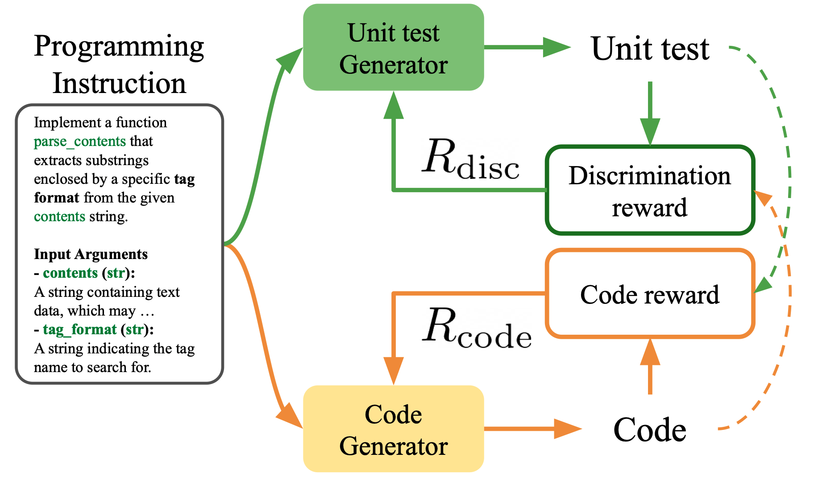

# UTRL: Learning to Generate Unit Test via Adversarial Reinforcement Learning (ICLR 26')

<div align="center">

**🚀 Adversarial RL framework for training LLMs for Unit test Generation**

[](https://openreview.net/)
[](https://arxiv.org/abs/2508.21107)
[](https://huggingface.co/models)
[](LICENSE)

*Dongjun Lee¹, Changho Hwang², Kimin Lee¹*  
*¹KAIST AI, ²Microsoft Research*

</div>

---

## What is UTRL?

**UTRL** introduces a **Reinforcement learning framework** that trains Large Language Models to generate high-quality unit tests. Unlike traditional approaches, UTRL only requires the dataset of task instruction-code pairs for training LLM as unit test generator.

### **Two-Step Adversarial RL Training**

UTRL iterates over the following steps:

<div align="center">

</div>

1. **Training Unit test Generator**: Unit test generator learns to distinguish code generated by code generator LLM from ground-truth code solution.
2. **Training Code generator**: Code generator learns to pass increasingly sophisticated unit tests generated by unit test generator.

### 🎪 Why UTRL?

Unit tests enables (1) reliable software development, (2) quantitative evaluation over code, (3) Test-time scaling / RLVR in code generation domain, but implementing reliable unit tests is **labor-intensive** and requires **sophisticated code reasoning**. 
However, algorithm for training LLMs for unit test generation has been underexplored, compared to code generation.

- 🧠 **Lack of training data with high-quality unit test annotations**
- 🔍 **Lack of research on algorithm for training LLMs for unit test generation**
- ⚡ **Lack of reliable evaluation protocol for measuring the quality of LLM generated unit tests**


## 📊 Experiments

### Evaluation Metrics
In order to evaluate the quality of unit tests, we introduce 2 evaluation metrics, **Best-of-N improvement** and **Unit Test Fidelity**.

**1. Best-of-N Improvement**
- Measures whether generated unit tests can identify highest-quality code solution among code solutions of varying qualities.
- Process: Generate N candidate solutions per programming task using LLM → Select best one using generated unit tests → Evaluate the selected code against ground-truth unit test.

**2. Unit Test Fidelity**
- Quantifies how closely generated unit tests approximate ground-truth unit tests.
- Computed as Spearman's correlation between code score vectors (evaluated with generated unit tests vs. ground-truth unit tests)
- Higher correlation = better approximation of comprehensive ground-truth unit tests

### Experimental Results
We evaluate the quality of generated unit tests on 945 competitive programming tasks from TACO and 511 tasks from LiveCodeBench-v2.

**Key Findings:**

1. **UTRL surpasses supervised fine-tuning**: Models trained with UTRL (without ground-truth unit tests) generate higher-quality unit tests than models trained with SFT using ground-truth unit tests, demonstrating that learning to detect LLM-generated code solutions is more effective than directly imitating ground-truth unit tests.

2. **Small models trained via UTRL outperform large closed-source models**: Qwen3-4B trained with UTRL generates higher-quality unit tests than GPT-4o and GPT-4.1, achieving **14.9% accuracy** compared to GPT-4o's 10.6% and GPT-4.1's 13.7% (when evaluating Qwen3-8B code generation).

3. **Unit-tests generated by small model trained via UTRL improve larger code generator models**: Unit tests generated by UTRL-trained 4B models effectively improve code generation of much larger models (32B, GPT-4o).

Please check our [paper](https://arxiv.org/abs/2508.21107) for more details.


## 🚀 Quick Start & Reproduction

### 📝 **Prerequisites**

#### **System Requirements**
- **GPU**: NVIDIA H100 80GB + CUDA 12.4 (recommended)
- **OS**: Linux (Ubuntu 20.04+)

#### **Dependencies**
```bash
# Clone the repository
git clone https://github.com/dgjun32/UTRL.git
cd UTRL

# Create conda environment
conda create -n utrl python==3.10
conda activate utrl

# install dependencies for verl
cd verl
USE_MEGATRON=0 bash scripts/install_vllm_sglang_mcore.sh
pip install --no-deps -e .
cd ..

# install additional dependencies
pip install -r requirements.txt
```

#### **Authentication Setup**
```bash
# Login to Hugging Face for model access
huggingface-cli login

# Login to Weights & Biases for experiment tracking
wandb login
```

### 📊 **Evaluation**
#### 0. Download checkpoints
We provide two checkpoints, where we fine-tuned Qwen3-4B and Qwen3-14B via UTRL, using instruction-code pairs provided in the TACO dataset.
* Link: xxxx

#### 1. Generate unit tests using the trained checkpoint

```bash
python -m inference.generate_unit_tests \
    --test_generation_model ${checkpoint_path} \
    --target_path ${signature of the checkpoint (e.g., qwen3_4b_utrl)} \
    --dataset ${dataset for evaluation (taco or livecodebench)} \
    --split test \
```
Please refer to `scripts/run_inference.sh`.

#### 2. Evaluate the generated unit tests (unit test fidelity & best-of-N improvement)

You may download evaluation set built upon [TACO](https://huggingface.co/datasets/BAAI/TACO) and [LiveCodeBench-v2](https://huggingface.co/datasets/livecodebench/execution-v2) to measure `best-of-N improvement` and `Unit test Fidelity`.

```python
import datasets
from datasets import load_dataset

taco_dataset = load_dataset('dgjun32/UTRL_TACO_EVAL')
livecodebench_dataset = load_dataset('dgjun32/UTRL_LCB_EVAL')
```

For Best-of-N improvement, run the commands below:

```bash
python -m evaluation.evaluate_bon_solution --benchmark taco \
  --test_generation_model ${signature of the checkpoint (e.g., qwen3_4b_utrl)} \
  --solution_generation_model qwen3_4b \
  --best_of_n \
  --n_samples 32

python -m evaluation.evaluate_bon_solution --benchmark taco \
  --test_generation_model ${signature of the checkpoint (e.g., qwen3_4b_utrl)} \
  --solution_generation_model qwen3_8b \
  --best_of_n \
  --n_samples 32

python -m evaluation.evaluate_bon_solution --benchmark taco \
  --test_generation_model ${signature of the checkpoint (e.g., qwen3_4b_utrl)} \
  --solution_generation_model qwen3_14b \
  --best_of_n \
  --n_samples 32

python -m evaluation.evaluate_bon_solution --benchmark taco \
  --test_generation_model ${signature of the checkpoint (e.g., qwen3_4b_utrl)} \
  --solution_generation_model gpt_4o \
  --best_of_n \
  --n_samples 32
```

For best-of-N improvement induced by ground-truth unit tests (which is required for computing `unit test fidelity`), you may run following scripts:

```bash 
python -m evaluation.evaluate_bon_solution --benchmark taco \
  --test_generation_model ground_truth \
  --solution_generation_model qwen3_4b \
  --best_of_n \
  --n_samples 32

python -m evaluation.evaluate_bon_solution --benchmark taco \
  --test_generation_model ground_truth \
  --solution_generation_model qwen3_8b \
  --best_of_n \
  --n_samples 32

python -m evaluation.evaluate_bon_solution --benchmark taco \
  --test_generation_model ground_truth \
  --solution_generation_model qwen3_14b \
  --best_of_n \
  --n_samples 32

python -m evaluation.evaluate_bon_solution --benchmark taco \
  --test_generation_model ground_truth \
  --solution_generation_model gpt_4o \
  --best_of_n \
  --n_samples 32
```

For Unit test fidelity, run the commands below:

```bash
python -m evaluation.compute_ut_fidelity \
  --benchmark taco \
  --test_generation_model ${signature of the checkpoint (e.g., qwen3_4b_utrl)} \
```

### 🏃‍♂️ **Training**
We provide scripts for training Qwen3-4B and Qwen3-14B via **UTRL**. Note that the RL training requires long time to run (e.g., 2 days for training Qwen3-4B via UTRL using 15K training samples in TACO dataset).

#### **1. UTRL - Iteration 1**
```bash
# Create data for training unit test generator
bash scripts/prepare_ut_data_iter_1.sh

# Train UT generator LLM via UTRL
bash scripts/train_ut_model_iter_1.sh

# Create data for training code generator
bash scripts/prepare_code_data_iter_1.sh ${ut generator ckpt step (50)}

# Train Code generator LLM via UTRL
bash scripts/train_code_model_iter_1.sh
```

#### **2. UTRL - Iteration 2**
```bash
# Create data for training unit test generator
bash scripts/prepare_ut_data_iter_2.sh ${code generator ckpt step (370)}

# Train UT generator LLM via UTRL
bash scripts/train_ut_model_iter_2.sh ${ut generator ckpt step (50)}
```


## 📚 Citation

If you find UTRL useful in your research, please consider citing our work:

```bibtex
@article{lee2025learning,
  title={Learning to generate unit test via adversarial reinforcement learning},
  author={Lee, Dongjun and Hwang, Changho and Lee, Kimin},
  journal={arXiv preprint arXiv:2508.21107},
  year={2025}
}
```
